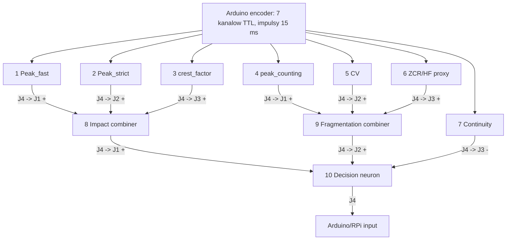

# Lu.i 10-neuron architecture for glass detection

## Cel

Celem tej architektury jest szybki test laboratoryjny detekcji tluczonego szkla
na 10 plytkach Lu.i, przy twardym ograniczeniu:

- jeden neuron ma maksymalnie 3 wejscia: `J1`, `J2`, `J3`
- jeden neuron ma jedno wyjscie: `J4`
- w wersji bazowej nie stosujemy fan-outu, czyli `1 wyjscie J4 -> 1 wejscie`
- Arduino generuje tylko cyfrowe impulsy TTL dla warstwy L0

Architektura jest interpretowalna: osobno wykrywa uderzenie, osobno
fragmentacje/rezonans, a ciagly dzwiek mowy lub muzyki hamuje decyzje.

## Dlaczego zmieniamy poprzedni uklad

Poprzedni wariant z `Peak-A`, `Peak-B`, `Peak-C` jako trzema kopiami tego samego
sygnalu poprawia odpornosc na rozrzut trymerow, ale zuzywa trzy plytki na bardzo
podobna informacje.

Lepszy uklad dla 10 neuronow wykorzystuje te same 10 plytek, ale daje trzy
rozne typy dowodu:

1. `Impact` - krotki, mocny transient.
2. `Fragmentation` - mikro-szpilki, nieregularnosc i wysoka czestotliwosc.
3. `Continuity` - wzorzec ciagly, ktory dziala hamujaco.

To lepiej pasuje do fizyki dzwieku tluczonego szkla: najpierw jest uderzenie,
potem chaotyczny rozpad/rezonans, a nie dlugi stabilny sygnal jak mowa lub
muzyka.

## Diagram architektury



*Source: `docs/diagrams/lui-10-neuron-architecture.mmd`. Graphviz source is
also available in `docs/diagrams/lui-10-neuron-architecture.dot`.*



Editable diagram sources:

- Mermaid: `docs/diagrams/lui-10-neuron-architecture.mmd`
- Rendered SVG: `docs/diagrams/lui-10-neuron-architecture.svg`
- Graphviz: `docs/diagrams/lui-10-neuron-architecture.dot`

Graphviz rendering was not generated in this workspace because `dot` is not
installed locally. The Mermaid SVG was generated successfully.

## Lista neuronow

| Nr | Neuron | Warstwa | Rola |
|---:|---|---|---|
| 1 | `Peak_fast` | L0 | Czuly detektor szybkiego transientu. |
| 2 | `Peak_strict` | L0 | Surowszy detektor mocnego piku. |
| 3 | `crest_factor` | L0 | Detektor ostrosci impulsu: wysoki peak wzgledem RMS. |
| 4 | `peak_counting` | L0 | Liczba mikro-szpilek w ramce 20 ms. |
| 5 | `CV` | L0 | Zmiennosc amplitudy w ramce. |
| 6 | `ZCR/HF proxy` | L0 | Zero-crossing/high-frequency proxy dla szorstkosci. |
| 7 | `Continuity` | L0 | Dzwiek ciagly: mowa, muzyka, dlugi szum. |
| 8 | `Impact` | L1 | Laczy Peak_fast, Peak_strict i crest_factor. |
| 9 | `Fragmentation` | L1 | Laczy peak_counting, CV i ZCR/HF. |
| 10 | `Decision` | L2 | Decyzja: Impact + Fragmentation, hamowana przez Continuity. |

## Schemat polaczen

### Arduino -> L0

| Arduino pin | Kanal firmware | Plytka Lu.i | Port | Polaryzacja |
|---|---|---|---|---|
| `D6` | `Peak_fast` | `Peak_fast` | `J1` | `+` |
| `D7` | `Peak_strict` | `Peak_strict` | `J1` | `+` |
| `D11` | `crest_factor` | `crest_factor` | `J1` | `+` |
| `D10` | `peak_counting` | `peak_counting` | `J1` | `+` |
| `D8` | `CV` | `CV` | `J1` | `+` |
| `D5` | `ZCR/HF proxy` | `ZCR/HF proxy` | `J1` | `+` |
| `D9` | `Continuity` | `Continuity` | `J1` | `+` |
| `GND` | wspolna masa | wszystkie plytki | `GND` | wspolna szyna |

Uwaga: `D10` i `D11` sa pinami SPI na Arduino Uno/Nano. Jezeli ta sama plytka
ma rownoczesnie uzywac sprzetowego SPI, przenies `peak_counting` i
`crest_factor` na inne wolne piny.

### L0 -> L1

| Skad `J4` | Dokad | Port | Polaryzacja | Sens |
|---|---|---|---|---|
| `Peak_fast` | `Impact` | `J1` | `+` | Transient czuly. |
| `Peak_strict` | `Impact` | `J2` | `+` | Transient mocny. |
| `crest_factor` | `Impact` | `J3` | `+` | Ostrosc impulsu. |
| `peak_counting` | `Fragmentation` | `J1` | `+` | Mikro-szpilki. |
| `CV` | `Fragmentation` | `J2` | `+` | Nieregularnosc amplitudy. |
| `ZCR/HF proxy` | `Fragmentation` | `J3` | `+` | Szorstkosc / wysokie skladowe. |

### L1/L0 -> Decision

| Skad `J4` | Dokad | Port | Polaryzacja | Sens |
|---|---|---|---|---|
| `Impact` | `Decision` | `J1` | `+` | Warunek uderzenia. |
| `Fragmentation` | `Decision` | `J2` | `+` | Warunek rozpadu/rezonansu. |
| `Continuity` | `Decision` | `J3` | `-` | Inhibitor mowy/muzyki/szumow ciaglych. |
| `Decision` | Arduino/RPi | `J4` | output | Finalny spike alarmu. |

## Logika decyzyjna

Architektura implementuje nastepujace zachowanie analogowo przez wagi i stale
czasowe:

```text
if Continuity is active:
  suppress / strongly reduce Decision
else if Impact and Fragmentation are active close in time:
  fire Decision
else:
  no final spike
```

W praktyce neuron `Decision` nie wykonuje instrukcji `if`. To jest tylko opis
zamierzonego zachowania. Fizycznie realizuja to:

- dodatnia waga `Impact -> Decision`
- dodatnia waga `Fragmentation -> Decision`
- silna ujemna waga `Continuity -> Decision`
- srednia `tau_mem` na `Decision`, zeby Impact i Fragmentation mogly zsumowac
  sie w krotkim oknie czasowym

## Ustawienia poczatkowe

### L0: detektory szybkich cech

Dotyczy: `Peak_fast`, `Peak_strict`, `crest_factor`, `peak_counting`, `CV`,
`ZCR/HF proxy`.

| Parametr | Start | Cel strojenia |
|---|---|---|
| `tau_syn` | krotko, ok. 15-30 ms | Reakcja na pojedyncze impulsy Arduino. |
| `tau_mem` | krotko-srednio, ok. 100-300 ms | Bez dlugiego podtrzymania. |
| `V_leak` | nisko, ok. 25-30% paska LED | Brak spike w ciszy. |
| `W1` | zaczac srednio | Jeden impuls ma byc widoczny, ale nie musi zawsze progowac. |

`Peak_strict` powinien miec wyzszy prog w firmware niz `Peak_fast`, nie tylko
inna wage na plytce. To robi z niego inny dowod, a nie kopie tego samego
kanalu.

### L0: Continuity

| Parametr | Start | Cel strojenia |
|---|---|---|
| `tau_syn` | dlugo, ok. 150-200 ms | Sumowanie dluzszego wzorca. |
| `tau_mem` | wysoko, ok. 1.5-2 s | Podtrzymanie inhibitora. |
| `V_leak` | nisko, ok. 25-30% | Brak spike w ciszy. |
| `W1` | srednio-wysoko | Mowa/muzyka maja uruchamiac ten neuron. |

Continuity nie powinno odpalac na pojedyncze krotkie uderzenie szklem. Ma
reagowac na sustained pattern: mowa, muzyka, ciagly szum, dzwiek radia.

### L1: Impact

Wejscia:

- `J1 = Peak_fast +`
- `J2 = Peak_strict +`
- `J3 = crest_factor +`

Start wag:

| Wejscie | Waga startowa | Oczekiwane zachowanie |
|---|---:|---|
| `Peak_fast` | 30-35% progu | Sam zwykle nie wystarcza. |
| `Peak_strict` | 40-50% progu | Mocny dowod, ale nadal lepiej z drugim kanalem. |
| `crest_factor` | 30-40% progu | Wspiera ostre transienty. |

Cel: `Impact` odpala, gdy wystapi mocny i ostry transient. Ma byc odporny na
pojedyncze przypadkowe piki.

### L1: Fragmentation

Wejscia:

- `J1 = peak_counting +`
- `J2 = CV +`
- `J3 = ZCR/HF proxy +`

Start wag:

| Wejscie | Waga startowa | Oczekiwane zachowanie |
|---|---:|---|
| `peak_counting` | 40-50% progu | Najwazniejszy kanal tej grupy. |
| `CV` | 20-30% progu | Slabszy kanal pomocniczy. |
| `ZCR/HF proxy` | 30-40% progu | Wspiera szorstkosc/wysokie skladowe. |

Cel: `Fragmentation` odpala na chaotyczny rozpad, mikro-szpilki i szorstka
wysoka zawartosc, a nie na pojedynczy gladki impuls.

### L2: Decision

Wejscia:

- `J1 = Impact +`
- `J2 = Fragmentation +`
- `J3 = Continuity -`

Start wag:

| Wejscie | Waga startowa | Oczekiwane zachowanie |
|---|---:|---|
| `Impact` | 45-55% progu | Sam nie powinien stale alarmowac. |
| `Fragmentation` | 40-50% progu | Razem z Impact ma przekroczyc prog. |
| `Continuity` | silna ujemna | Ma blokowac falszywe alarmy z mowy/muzyki. |

Tryb bardziej czuly na start:

- `Impact`: 60-70%
- `Fragmentation`: 30-40%
- `Continuity`: silna ujemna

Tryb bardziej konserwatywny po pierwszych testach:

- `Impact`: 45-50%
- `Fragmentation`: 45-50%
- `Continuity`: silna ujemna

## Progi firmware Arduino

To sa wartosci startowe, nie finalne. Finalne progi trzeba dobrac z realnych
nagran z laboratorium.

| Kanal | Cecha | Start |
|---|---|---:|
| `Peak_fast` | peak ADC deviation | 90 |
| `Peak_strict` | peak ADC deviation | 150 |
| `crest_factor` | crest factor x100 | 280 |
| `peak_counting` | liczba mikro-szpilek w 20 ms | 7 |
| `CV` | coefficient of variation x100 | 90 |
| `ZCR/HF proxy` | zero crossing count / HF proxy | 8-12 |
| `Continuity` | RMS + ZCR przez kolejne ramki | >= 200 ms |

Kazdy impuls z Arduino:

- szerokosc: 15 ms
- minimalny odstep startow impulsow: 30 ms
- typ: TTL HIGH na wejscie `J1` plytki L0

## Sekwencja testow laboratoryjnych

### Krok 1: masa i sanity check

1. Polacz `GND Arduino` i `GND` wszystkich 10 plytek na jednej szynie.
2. Nie podlaczaj jeszcze polaczen miedzy plytkami.
3. Wgraj firmware Arduino.
4. Sprawdz Serial Monitor: cechy powinny zmieniac sie na ciszy, mowie i szkle.

### Krok 2: kalibracja kazdej L0 osobno

Dla kazdej plytki L0:

1. Podlacz tylko jeden pin Arduino do `J1`.
2. Ustaw przelacznik wejscia na `+`.
3. Cisza: gorna dioda spike ma milczec.
4. Docelowy dzwiek: kanal ma spike'owac.
5. Najpierw stroisz prog w Arduino, potem wage `W1`, potem dopiero
   `V_leak/tau`.

### Krok 3: Impact

1. Podlacz `Peak_fast`, `Peak_strict`, `crest_factor` do `Impact`.
2. Testuj: cisza, stukniecie, szklo.
3. `Impact` powinien reagowac na krotkie ostre zdarzenia.
4. Jezeli reaguje na zbyt wiele stukniec nieszklistych, zmniejsz `Peak_fast`
   albo zwieksz wymaganie `crest_factor`.

### Krok 4: Fragmentation

1. Podlacz `peak_counting`, `CV`, `ZCR/HF proxy` do `Fragmentation`.
2. Testuj szklo vs mowa/muzyka.
3. `Fragmentation` powinien byc aktywny przy chaotycznym rozpadzie, a nie przy
   stabilnym sygnale.

### Krok 5: Continuity

1. Testuj `Continuity` osobno.
2. Mowa/muzyka/radio: powinno spike'owac.
3. Krotkie uderzenie szklem: nie powinno stale spike'owac.

### Krok 6: Decision

1. Podlacz `Impact -> J1 +`.
2. Podlacz `Fragmentation -> J2 +`.
3. Podlacz `Continuity -> J3 -`.
4. Finalny spike `Decision J4` podlacz do Arduino/RPi jako wyjscie alarmu.

## Macierz oczekiwan

| Material testowy | Impact | Fragmentation | Continuity | Decision |
|---|---:|---:|---:|---:|
| Cisza | 0 | 0 | 0 | 0 |
| Mowa | 0/1 | 0/1 | 1 | 0 |
| Muzyka | 0/1 | 0/1 | 1 | 0 |
| Pojedyncze stukniecie | 1 | 0/1 | 0 | 0/1 |
| Tluczone szklo | 1 | 1 | 0 | 1 |
| Ciagly metaliczny halas | 0/1 | 1 | 1 | 0 |

`0/1` oznacza, ze dany kanal moze czasem zareagowac, ale nie powinien sam
decydowac o alarmie.

## Minimalny wariant testowy

Jesli trzeba uruchomic system najszybciej:

1. Uruchom `Peak_fast`, `Peak_strict`, `crest_factor` i `Impact`.
2. Podlacz `Impact` bezposrednio do `Decision J1`.
3. Ustaw `Decision` bardzo ostroznie i obserwuj falszywe alarmy.
4. Dopiero potem dodaj `Fragmentation`.
5. Na koncu dodaj `Continuity` jako inhibitor.

Nie podlaczaj calej sieci naraz przed sprawdzeniem pojedynczych plytek.

## Kryteria akceptacji pierwszego testu

Pierwszy test jest udany, jezeli:

1. Kazdy kanal L0 mozna wywolac i wyciszyc osobno.
2. `Impact` odpala na szklo i ostre uderzenia.
3. `Fragmentation` odpala czesciej na szklo niz na mowe/muzyke.
4. `Continuity` odpala na mowe/muzyke, ale nie blokuje krotkiego zdarzenia
   szklisto-udarowego.
5. `Decision` nie spike'uje na ciszy.
6. `Decision` spike'uje na wiekszosci probek szkla.
7. Przy mowie/muzyce `Decision` pozostaje wyciszony dzieki inhibitorowi.

## Decyzje projektowe

- Nie uzywamy fan-outu `J4`, dopoki nie zostanie osobno potwierdzony pomiarowo.
- Nie marnujemy trzech pletek na trzy kopie Peak.
- `Peak_strict` jest osobnym progiem firmware, a nie tylko inna waga analogowa.
- `ZCR/HF proxy` zastepuje trzecia kopie Peak, bo wnosi informacje o wysokiej
  czestotliwosci/szorstkosci.
- `Continuity` jest hamujace tylko na `Decision`, nie blokuje warstw nizszych.
