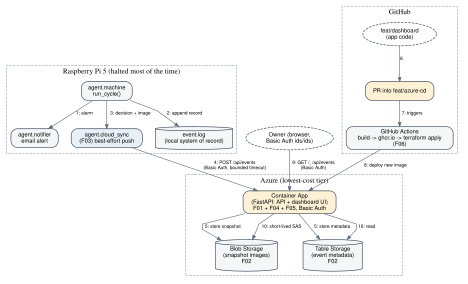

# Wake-Up AI Cloud Dashboard — System Overview

## Summary

Extend the existing Wake-Up AI RPi 5 agent (`rpi_agents/agent/`) with a
best-effort push of each wake-cycle decision — metadata, snapshot image,
Gemini reasoning, email-delivery status — to an Azure backend, and add a
small authenticated web dashboard that reads from that backend. The Pi
remains the system of record for what actually happened (`event.log`); Azure
is a queryable, always-available copy for the owner.

## Deployment Target & Environment

*(Revised 2026-07-14 — see ADR-0007 through ADR-0013 for the full
"why": cheapest possible, container-based, fixed-credential auth,
Terraform + GitHub Actions CD, all at the owner's explicit request.)*

- **Repo / branches:** `Industrial-Data-Science-AGH/SNN_Agent`. All of T01
  through T04 (Terraform infra, the GitHub Actions CD workflow, the FastAPI
  app, the Pi push client) are developed and tested locally on a single
  branch, **`feat/dashboard`** (branched off `feat/rpi` before any of this
  work started — see `02-delivery.md`, "Branch & Commit Strategy," revised
  2026-07-14 to match how the owner is actually executing this build).
  **`feat/azure-cd`** is created later, once development is complete,
  branched off the finished `feat/dashboard` — it becomes the deploy-target
  branch the GitHub Actions workflow (`.github/workflows/deploy.yml`)
  reacts to (its trigger condition, `pull_request` into `feat/azure-cd`,
  ADR-0013, doesn't care when that branch was created, only that it exists
  by the time a PR targets it). New code lives under
  `rpi_agents/agent/cloud_sync.py` (Pi side) and a new `rpi_agents/cloud/`
  folder (`cloud/app/` — the FastAPI container; `cloud/infra/` —
  Terraform) — all committed to `feat/dashboard` as it's built.
- **Cloud target:** Microsoft Azure, subscription funded by Azure for
  Students credit. Every service defaults to the tier that is effectively
  $0/month once the credit is exhausted — no fixed-cost resource (no VM, no
  Azure Container Registry) is in the design (ADR-0007, ADR-0012).
- **Compute:** one Azure Container App, Consumption (scale-to-zero) plan,
  running a single Python FastAPI application that serves both the API and
  the dashboard UI (ADR-0007, ADR-0008).
- **Frontend:** server-rendered pages from the same FastAPI app — no
  separate frontend hosting resource (ADR-0008).
- **Storage:** one Azure Storage Account — Blob container for snapshot
  images, Table for event metadata (ADR-0007).
- **Auth:** one fixed HTTP Basic Auth credential (`ids`/`ids` default,
  environment-overridable), shared by the dashboard viewer and the Pi's
  push client (ADR-0009).
- **Secrets:** GitHub Actions repository secrets → Terraform sensitive
  variables → Azure Container App native secrets; the Pi-side copy of the
  same credential lives in `~/.config/snn-agent/.env`, the same file and
  permissions (`chmod 600`) already used for `GEMINI_API_KEY` etc.
  (ADR-0010).
- **IaC:** Terraform, `azurerm` provider, state in a private Blob container
  in the same Storage Account (ADR-0011).
- **Container registry:** GitHub Container Registry (`ghcr.io`), free at
  this project's scale (ADR-0012).
- **Deployment tooling:** GitHub Actions workflow — build image, push to
  `ghcr.io`, `terraform apply` (ADR-0013). No manual deploy step.

## Current state *(brownfield — what this touches)*

- **Keep, unchanged:** `agent/vision.py` (Gemini call + fail-open-to-alarm),
  `agent/actuators.py`, `agent/power.py`, `agent/trigger.py`, `agent/camera.py`.
  This feature does not touch the decision or alarm logic at all.
- **Change:** `agent/machine.py::run_cycle()` — after `notifier.notify()`
  (success or failure), capture an `email_sent: bool` and pass the full
  record (already-computed fields + this new one) to the new push client
  instead of only to `_log_event()`. `agent/machine.py::_log_event()` gains
  the `email_sent` field in its local JSON record too, so the local log and
  the cloud copy share one schema (see F03 design, Data model).
- **New:** `agent/cloud_sync.py` (Pi push client, F03) and its local
  `sync_queue.jsonl` backlog (bounded, 20 events — ADR-0015), `cloud/app/`
  (one FastAPI container serving both the ingest/read API — F01 — and the
  dashboard UI — F04), `cloud/infra/` (Terraform for Storage + Container
  App, F02), Basic Auth middleware shared by F01/F04 (F05), and
  `.github/workflows/deploy.yml` (F06, new — build/push/apply pipeline).
  `event_id` is generated on the Pi (ULID) and sent in the ingest payload;
  `POST /api/events` upserts on it instead of generating its own, so a
  queued retry is always safe (ADR-0014).
- **Superseded, not reused:** the previous `dashboard/` package
  (`app.py`, `store.py`, `metrics.py`, `render.py`, `design.py` — source
  deleted, only stale `__pycache__` remains). It was architected as a
  Pi-hosted dashboard, which does not satisfy "viewable while the Pi is
  halted." No attempt is made to recover or reuse it.

## Problem & Constraints

- The Pi is halted the large majority of its life (that's the entire point
  of the SNN wake-trigger design) — a dashboard hosted **on** the Pi is
  unreachable almost all the time. The dashboard must be hosted somewhere
  that stays up independent of the Pi's power state.
- The Pi's own operating contract (`README.md`'s POWER CONTRACT, and the
  fail-safe philosophy in `vision.py`) must not be weakened: nothing this
  feature adds may block or meaningfully delay `power.resleep()`.
- Network at the Pi is intermittent (Wi-Fi hotspot today, home network
  later) — delivery cannot be assumed reliable.
- Budget: Azure for Students credit now, but the design must not silently
  become expensive once that credit is gone.
- The data is privacy-sensitive (home snapshot images, occupancy-revealing
  timestamps) — must not be publicly readable.

## Evaluation Framework

This is an infrastructure/observability feature, not a model — "evaluation"
here means reliability against explicit SLOs, not accuracy.

- **Primary metric:** end-to-end push success rate (fraction of wake cycles,
  with network available, whose event is visible in the dashboard within
  30 seconds of the local `event.log` write).
- **Baseline:** 0% today — there is no cloud visibility at all; the only way
  to see a decision is SSH + `tail event.log`.
- **SLO / acceptance thresholds:**
  - The push attempt adds **≤5 seconds** to the Pi's wake-cycle-to-resleep
    time, even on total failure (bounded connect+read timeout, no retries
    that block re-halt).
  - When the Pi has network at wake time, **≥95%** of pushes succeed on the
    first attempt in manual testing across at least 20 cycles.
  - Dashboard reflects a successfully-pushed event within 30 seconds
    (Functions Consumption cold start is the dominant latency source and is
    acceptable at this volume — no de-risking spike needed, see below).
- **Offline check:** unit tests mock the HTTP call in `agent/cloud_sync.py`
  and assert the bounded timeout and non-blocking-on-failure behavior
  (mirrors the existing pattern in `tests/test_notifier.py`).
- **Online check:** manual E2E runbook step — trigger a real wake with
  network available, confirm the event, image, and reasoning appear in the
  dashboard, and that the `email_sent` flag matches what actually happened
  (test both a successful send and a forced SMTP failure). Additionally
  (ADR-0015): trigger 2-3 wakes with network disabled, confirm they land in
  `sync_queue.jsonl` and not the dashboard, then re-enable network and
  confirm the next wake cycle flushes the backlog and all queued events
  appear.
- **De-risking spike:** none required. The one plausible unknown — Azure
  Functions Consumption cold-start latency — doesn't threaten the design
  because the push is fire-and-forget from the Pi's perspective (bounded
  timeout either way) and the dashboard is not itself latency-sensitive.

## System Design

*Source: `docs/diagrams/overview.dot` — edit and re-run `render_diagrams.sh`.*

Six features carry this design (full detail in
`features/F01..F06/design.md`, dependency order in `module-map.json`):

- **F02 storage_infra** — one Azure Storage Account (Blob + Table), Terraform
  IaC. Foundational; everything else depends on it existing.
- **F01 ingest_api** — routes inside the one FastAPI container: `POST
  /api/events` (ingest) and `GET /api/events` / `GET /api/events/{id}`
  (dashboard reads) — all behind the same Basic Auth middleware (F05).
- **F03 pi_push_client** — `agent/cloud_sync.py`, wired into
  `machine.run_cycle()`, best-effort/non-blocking POST with bounded timeout,
  authenticated with the shared Basic Auth credential.
- **F04 dashboard_ui** — server-rendered pages from the same FastAPI
  container: event list, real-vs-false-alarm counts (client-side/template-
  side aggregation over the fetched event list — volume is low enough that a
  server-side aggregation endpoint isn't justified yet), per-event detail
  (image, Gemini reasoning, email status).
- **F05 auth_and_secrets** — fixed HTTP Basic Auth (default `ids`/`ids`,
  env-overridable) protecting every route, dashboard and ingest alike;
  secrets flow from GitHub Actions through Terraform into the Container
  App's native secret store.
- **F06 deployment_pipeline** *(new)* — Terraform module for the Container
  App + Storage, and the GitHub Actions workflow that builds the image,
  pushes to `ghcr.io`, and applies the Terraform on every push.

## Security

Full per-feature threat notes live in each feature's `design.md` Security
subsection; summarized here (STRIDE-lite pass; the dedicated `cybersecurity`
skill was not available in this environment, so this is a direct manual
pass — flagged as a residual risk below):

- **Ingest endpoint is a public HTTP surface.** Mitigated by requiring the
  same fixed Basic Auth credential as the dashboard (ADR-0009); JSON schema
  + max body/image size validation to bound cost-of-abuse; Container Apps
  Consumption plan's large free monthly grant makes low-volume abuse
  economically irrelevant, high-volume abuse is an accepted residual risk
  deferred to a follow-up (rate limiting) if it's ever observed.
- **Dashboard exposes privacy-sensitive images/timestamps.** Mitigated by
  the same Basic Auth requirement on every route (ADR-0009) — deliberately
  simple rather than federated identity, at the owner's explicit request;
  images served via short-lived (15 min) SAS URLs generated per
  authenticated request, never a public container or long-lived URL.
- **Secrets.** The Storage connection string and the Basic Auth password
  flow from GitHub Actions secrets through Terraform into the Container
  App's native secret store (encrypted at rest), never in Terraform source
  or the repo. Pi-side copy of the shared credential follows the existing
  `~/.config/snn-agent/.env` pattern (ADR-0010). Key Vault was considered
  and deferred — documented trade-off, not an oversight.
- **Residual risk:** the GitHub Actions CD pipeline applies Terraform with no
  staging/approval gate (ADR-0013), and no automated SAST/dependency
  scanning is configured. Flagged in Risks below.

## Risks

| Risk | Impact | Mitigation |
|------|--------|------------|
| No approval gate / automated security scanning on the CD pipeline | Vulnerable dependency or misconfig could ship straight to the live Container App | Accepted at single-owner hobby scale (ADR-0013); revisit if this ever gets a second user or higher-value data |
| Event/image volume grows unbounded over time | Storage cost creep, slower client-side aggregation | Deferred retention-policy ADR once real volume is observed (see PR/FAQ Open questions) |
| The one Basic Auth credential leaks or is left at the `ids`/`ids` default | Attacker can read all history/images and write fake events | HTTPS-only transport, credential is env-injected (not hardcoded), rotatable via a GitHub secret update with no code change; owner explicitly encouraged to change the default before exposing the app publicly (ADR-0009) |
| Pi's Wi-Fi genuinely down at every wake for a stretch | Dashboard goes stale until reconnect, then catches up | Bounded local queue (20 events, ADR-0015) retries on every subsequent wake cycle once connectivity returns; beyond the cap the oldest queued events are still dropped, and `event.log` on the Pi remains the complete authoritative record regardless — no alerting on dropped/pending pushes in this phase |
