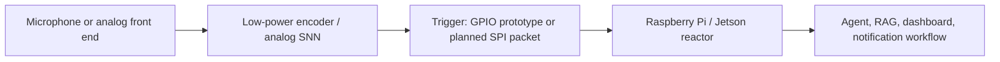

# Project Analysis

Analysis date: 2026-06-04

## Scope

This analysis is based on direct source inspection of the current repository,
the existing Markdown docs, the project proposal PDF, CLI entry points,
dependency manifests, Arduino sketches, and lightweight verification commands.
Graphify was considered, but the local Graphify package is not installed and
the Graphify MCP endpoint was unavailable in this session, so the analysis was
performed directly from the source tree.

## Executive Summary

Wake-Up AI is currently two projects in one repository:

1. The active core is `snn_pipeline/`, a Python HAT/QAT pipeline for
   glass-break detection using a small spiking neural network constrained by
   analog hardware realities such as E24/E96 resistor values, threshold drift,
   mismatch, and MCP4151 digital potentiometer programming.
2. The hardware/software integration layer is at prototype stage:
   Arduino sketches emit/count voltage spikes, docs define a future SPI host
   trigger protocol, and the web dashboard/host-agent code is still a starter
   shell.

The root documentation currently describes aspirational directories such as
`hardware/`, `neuromorphic_core/`, and `firmware/` that do not exist. This
`rpi_agents/` bundle documents the actual repository layout without modifying
the root README.

## Actual Architecture

```mermaid
flowchart LR
  A["ESC-50 audio / microphone signal"] --> B["Preprocessing: bandpass + RMS"]
  B --> C["Spike encoding: TTFS or rate coding"]
  C --> D["GlassBreakSNN: N1, N2, N3, N_inh"]
  D --> E["HAT: Gumbel/E24 + mismatch"]
  E --> F["QAT: mixed precision + sensitivity"]
  F --> G["Evaluation: metrics, drift, power"]
  G --> H["Export: JSON, CSV, snn_config.h, MCP4151 table"]
  H --> I["Analog PCB / Arduino / host bridge"]
```



The intended deployed system is:



## Core Python Pipeline

`snn_pipeline/config.py` centralizes the project assumptions:

- Python-side device: CPU.
- Audio: 22,050 Hz, 500-8,000 Hz bandpass, 10 ms RMS window, 5 ms hop.
- LIF: 20 ms membrane constant, 1 ms simulation step.
- Hardware: `R_in=100k`, `R_syn=10k..470k`, `VCC=5V`, 1% resistor tolerance,
  5 mV threshold drift, 256-step MCP4151.
- Baseline neurons: `N1`, `N2`, `N3`, and `N_inh`.
- Training: 50 HAT epochs, 20 QAT epochs, recall target 0.85.

`snn_pipeline/data_pipeline.py` downloads ESC-50, splits positives and negatives,
preprocesses audio, augments glass-break samples, encodes spike trains, and
returns PyTorch DataLoaders.

`snn_pipeline/spike_encoders.py` implements:

- Rate coding: normalized energy maps to spike probability/frequency.
- TTFS: peak energy maps to earlier bursts, with low-energy noise suppressed.
- A helper that can encode envelope statistics as peak/mean/std channels.

`snn_pipeline/snn_model.py` defines `GlassBreakSNN`, a four-neuron snntorch model:

- `N1`: high-frequency detector.
- `N2`: temporal/burst detector.
- `N3`: trigger/output neuron.
- `N_inh`: inhibitor for HVAC/low-frequency noise.

The model supports quantization modes `none`, `hat`, `gumbel`, and `qat`, and it
can inject mismatch noise during training.

`snn_pipeline/losses.py` implements `HardwareAwareLoss`, combining BCE, soft F1,
precision penalty, recall penalty, and E24 regularization. This is aligned with
the business goal from the PDF: false positives are expensive because they wake
the high-power digital reactor.

`snn_pipeline/run_pipeline.py` orchestrates five phases:

| Phase | Code path | Role |
| --- | --- | --- |
| A | `phase_a` | Build data, DataLoaders, and baseline metrics |
| B | `phase_b` | HAT training with Gumbel quantization and mismatch |
| C | `phase_c` | QAT, sensitivity heatmap, MCP4151 candidate selection |
| D | `phase_d` | Benchmark, thermal drift, weight-error histogram, power estimate |
| E | `phase_e` | Export weights/header, HIL simulation, MCP4151 table |

## Hardware And Firmware State

The analog hardware docs are practical and mostly focused on early PCB bring-up:

- `docs/backplane_design.md`: star/crossbar topology, star grounding, SPI/noise
  separation, short spike traces, test points.
- `docs/synapse_design.md`: resistor-divider synapse equation and `R_syn`
  configurability.
- `docs/spi_protocol.md`: planned 2-byte SPI status/timestamp packet.

The Arduino code does not currently implement the SPI packet protocol:

- `encoder/snn_encoder/snn_encoder.ino` reads amplitude from `A0` and emits a
  0.5 ms voltage spike on pin `D2`.
- `encoder/snn_decoder/snn_decoder.ino` counts falling edges on pin `D3`.
- `rpi_agents/arduino_encoder_plan.md` separates this current GPIO prototype
  from the future SPI host trigger protocol.

The Python export path is ahead of the Arduino integration. `export.py` can
generate `snn_config.h` with a 2-byte SPI packet assumption, and
`hil_validation.py` can generate MCP4151 SPI write commands.

## Software Reactor State

`software/web_dashboard/api/app.py` is a minimal FastAPI app exposing only
`GET /health`.

`software/web_dashboard/ui/` is still the Vite/React starter shell.
`rpi_agents/web_dashboard_ui.md` documents that current state and the commands
needed after `npm ci`.

`software/host_agent/run.py` is a mock agent:

```python
def infer(prompt: str) -> str:
    return f"[mock] {prompt}"
```

`software/host_agent/rag/ingest.py` and `query.py` are Chroma smoke examples,
not a real project-document ingestion pipeline.

`software/infra/docker-compose.yml` is not aligned with the actual paths. It
uses `../backend` and `../frontend`, while the repository has
`software/web_dashboard/api` and `software/web_dashboard/ui`.

## Legacy Or Experimental Areas

`snn_simulator/` appears to be an older simulator sandbox. It has useful small
examples such as `neurons/lif.py` and synthetic data utilities, but
`snn_simulator/main.py` imports `models.snn_torch`, which is not present. Treat
`snn_pipeline/` as the active path.

`experiments/encoder.py` and `experiments/decoder.py` are empty.

`main.py` only prints `Hello from snn-agent!` and is not the project entry point.

## Documentation Gaps Found

- The root README does not match the current repository layout.
- There was no docs index before this `rpi_agents/docs_index.md` file.
- The web UI README is the default Vite README.
- The existing encoder plan describes SPI behavior that is not implemented in
  the checked-in Arduino sketch.
- The SPI protocol is a planned host/RPi protocol, not current Arduino behavior.

## Implementation Risks

1. `HATTrainer.calibrate_thresholds()` exists and its docstring describes it as
   an important fix, but `phase_b()` does not call it before training. The saved
   `debug_hat.txt` quick run shows `Recall: 0.0000`, which is consistent with
   the calibration issue described in the trainer docstring.
2. `pyproject.toml` has no dependencies even though the project depends on
   PyTorch, snntorch, librosa, SciPy, scikit-learn, matplotlib, tqdm, and
   soundfile. `requirements.txt` is currently the source of truth.
3. The checked-in Docker compose and Dockerfiles need path updates before they
   can build the actual dashboard/API layout.
4. The SPI protocol, Arduino encoder, and generated `snn_config.h` are not yet
   one integrated firmware path.
5. The host-agent/RAG/dashboard layer is a placeholder and does not yet consume
   SNN trigger events or exported model artifacts.
6. The current working tree has `docs/BOM.md` deleted and
   `docs/lu_i_hardware_bought.md` untracked. No maintained tracked BOM is
   available.

## Verification Performed

Syntax check:

```bash
env PYTHONPYCACHEPREFIX=/tmp/snn_agent_pycache python3 -m compileall -q snn_pipeline snn_simulator software/host_agent software/web_dashboard/api main.py test_forward.py
```

Result: passed.

Runtime checks in the current shell:

```bash
python3 test_forward.py
python3 -m snn_pipeline.run_pipeline --help
```

Result: both failed because `torch` is not installed in the available Python
3.9 environment. The project expects Python 3.12 and the dependencies from
`requirements.txt`.

Frontend check:

```bash
npm run build
```

Result: failed because frontend dependencies/type definitions are not installed
in `software/web_dashboard/ui/node_modules`. Run `npm ci` first.

